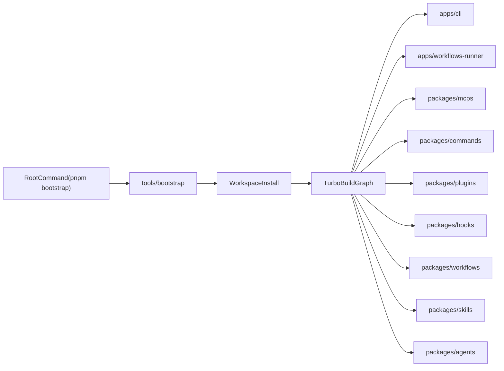

# muggle-ai-works Rename and Monorepo Design

## Objective

Use `muggle-ai-works` as the canonical repository name, then evolve it into a single installable workspace for agents, plugins, commands, skills, MCPs, hooks, and workflows.

This design prioritizes:

- no service disruption during rename
- low-risk incremental migration
- one clone + one command onboarding
- future extensibility without over-coupling packages

## Scope

Phase 1 scope is **rename-only** for the current repository.

- Do not consolidate other repositories in this phase.
- Keep current npm package and CLI compatibility in place.
- Introduce monorepo foundations after rename is stable.

## Design Principles

- **Compatibility first**: preserve existing install and runtime behavior before structural migration.
- **Small PRs**: one concern per PR to reduce rollback risk.
- **Contracts before wiring**: define package boundaries before integrating new runtime paths.
- **Centralized bootstrap**: root-level setup command owns first-time developer onboarding.
- **Explicit ownership**: apps consume packages; packages do not depend on app-level concerns.

## Target Repository Shape

```text
muggle-ai-works/
  apps/
    cli/                      # user-facing CLI distribution app
    workflows-runner/         # long-running workflow runner app
  packages/
    mcps/                     # MCP runtime, tool registries, shared integrations
    commands/                 # CLI command composition and handlers
    plugins/                  # plugin lifecycle contracts and extensions
    skills/                   # runtime skill metadata and contracts
    workflows/                # workflow orchestration contracts and models
    agents/                   # agent-level contracts and composition
    hooks/                    # hook contracts and dispatch integration points
  tools/
    bootstrap/                # setup scripts and environment checks
  configs/
    eslint/
    tsconfig/
  skills/                     # existing skills (kept during transition)
  docs/
  package.json                # workspace root scripts
  pnpm-workspace.yaml
  turbo.json
```

## Bootstrap Experience

Target onboarding flow:

1. clone repository
2. run one command from root
3. receive ready-to-use local environment

Recommended root command:

- `pnpm bootstrap`

Root `bootstrap` responsibility:

- install workspace dependencies
- build required packages
- run postinstall and local config wiring
- run a concise health check (`pnpm doctor`)

## Customer Install Contract

Official marketplace-facing install command:

- `npm install -g @muggleai/works`

Install guarantees:

- package CLI is globally available as `muggle`
- postinstall updates Cursor MCP server entry in `~/.cursor/mcp.json`
- postinstall ensures the expected Electron runtime version is present
- `muggle doctor` validates these install invariants and reports actionable fixes

## Migration Phases

## Phase 0: Rename Stabilization

Goal: rename repo with no behavior regression.

Key actions:

- Rename GitHub repository to `muggle-ai-works`.
- Update local `origin` remote URL.
- Update repository/release URLs used by:
  - package metadata
  - postinstall download logic
  - CLI help and upgrade links
  - skills/docs clone examples
- Align workflow branch expectations (`main` vs `master`).
- Validate release download and upgrade checks against the new repository path.

Success criteria:

- existing install path still works
- upgrade check still resolves release data
- CI and publish workflows pass after rename

## Phase 1: Monorepo Foundation

Goal: add pnpm + turbo orchestration without large code movement.

Key actions:

- Add `pnpm-workspace.yaml` and `turbo.json`.
- Add root scripts for install/build/lint/test/bootstrap/doctor.
- Keep current MCP package operational while staged into workspace structure.
- Introduce shared config folders (`configs/eslint`, `configs/tsconfig`) for future package consistency.

Success criteria:

- workspace commands run from root
- no runtime behavior change for current package
- CI can run monorepo root tasks

## Phase 2: Package Skeleton Introduction

Goal: create stable boundaries for future consolidation.

Key actions:

- Add empty or minimal `packages/*` skeleton packages with clear README contracts.
- Define contract-level interfaces for:
  - agent registration
  - plugin lifecycle
  - command registry
  - hook trigger model
  - workflow model
- Keep integration light until interfaces stabilize.

Success criteria:

- package boundaries are explicit
- package contracts are documented and versionable
- no hidden cross-layer coupling is introduced

## Phase 3: Incremental Migration

Goal: migrate existing logic into target package layout via small PRs.

Key actions:

- Move MCP logic into `packages/mcps` in incremental slices.
- Move command surface into `packages/commands` and keep `apps/cli` as thin entrypoint.
- Route shared models/utilities into dedicated runtime packages.
- Keep adapters where old and new paths need temporary coexistence.

Success criteria:

- build/test/lint remain green at each step
- each move is reversible
- final root bootstrap command remains unchanged

## Architecture Integration Flow



## Compatibility and Risk Controls

- Keep npm package name unchanged in early phases to avoid client breakage.
- Keep CLI command name unchanged until explicit deprecation strategy is approved.
- Use repository redirects and update all docs to canonical new URL immediately.
- Validate postinstall fallback URLs to avoid silent download failures.
- Avoid broad file moves in the same PR as URL/workflow changes.

## PR Plan

## PR 1: Rename Touchpoints Only

- URL references, workflow branch alignment, docs updates.
- No directory migrations.
- No package manager migration in this PR.

## PR 2: Workspace and Orchestration

- Add pnpm workspace and turbo root orchestration.
- Add root bootstrap and doctor commands.
- Preserve current package behavior.

## PR 3: Shared Config and Skeleton Packages

- Add `configs/*`.
- Add minimal `packages/*` contract skeletons.
- Add package-level docs for ownership and boundaries.

## PR 4+: Incremental Logic Migration

- Move existing MCP and command logic package by package.
- Keep each PR focused to one migration slice.

## Execution Checklist

- Confirm canonical GitHub org and repository path.
- Rename repository in GitHub.
- Update repo-linked URLs in source and docs.
- Align workflow branch triggers.
- Cut a validation release and verify install/upgrade flow.
- Introduce pnpm workspace and turbo root scripts.
- Add bootstrap/doctor path and verify one-command onboarding.
- Add package skeletons and begin incremental migration PRs.

## Out of Scope for This Design

- Consolidating other repositories in this phase.
- Renaming published npm package or CLI binary in phase 1.
- Deep feature development for agent/plugin runtime before boundary contracts are established.

## Decision Record

- Scope: rename-only in phase 1.
- Toolchain: pnpm + Turborepo.
- Delivery model: incremental PRs, one concern per PR.
